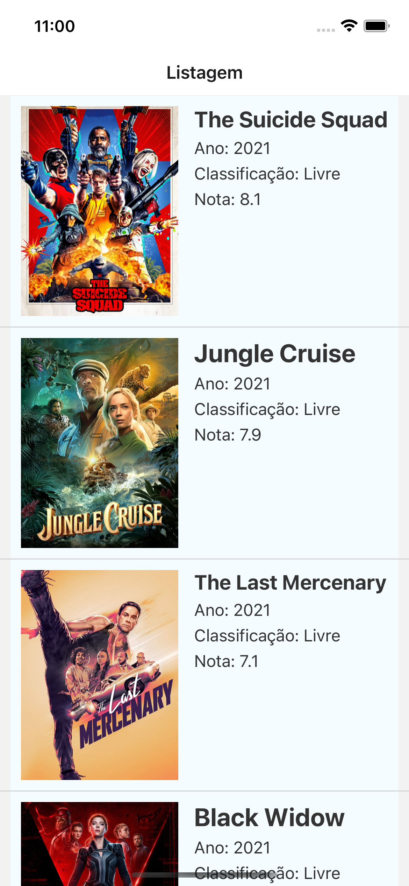
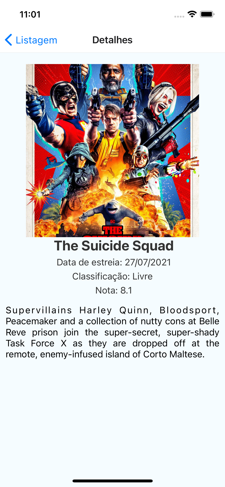

# Moovies

### App feito para a Pós Graduação em Desenvolvimento Mobile Unyleya - 2021/2

### Para rodar o app com sucesso, insira a sua API KEY do TMDB no arquivo `api.ts`

## Bibliotecas usadas

- Axios
- Date-fns
- React Navigation (Stack)

## Imagens do app em funcionamento

